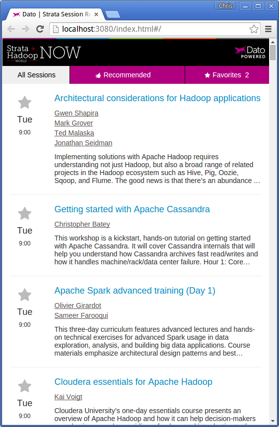

Code for creating and launching a web application with a content-based recommender model using Dato's [GraphLab Create](https://dato.com/products/create/) and [Predictive Services](https://dato.com/learn/userguide/deployment/introduction.html).

This app provides personalized recommendations for conference talks based on the abstract of each talk. It was used by more than 1000 attendees of the [Strata-Hadoop World Conference 2015](http://strataconf.com/big-data-conference-ca-2015/public/content/home) in San Jose.

[Live demo](http://stratanow.dato.com)

Here's a screenshot:



## Frontend 

### Requirements
  
OS X
```bash
brew install node
npm install -g gulp
```

Ubuntu 14 

```bash
curl -sL https://deb.nodesource.com/setup | sudo bash -
sudo apt-get install nodejs
sudo npm install -g gulp
```

### Installation
```bash
npm install
gulp
```

This should open a web browser with the app: [http://localhost:3080](http://localhost:3080).

## Building your machine-learning-as-a-service 

### Requirements

```python
pip install graphlab-create
```

For more details, see the [quick start guide](https://dato.com/products/create/quick-start-guide.html).

### Running

Scrape data from strataconf.com
```bash
cd data
python scrape.py
```

Create models and update predictive service
```bash
cd deploy
python run.py
```

Now you are able to get recommendations and similar talks via a REST API:

```bash
curl -X POST -d '{"api_key": "b9b8dd75-a6d3-4903-b6a7-2dc691d060d8", \
                  "data":{"input": {"item_ids":["43750"], "how_many": 5}}}' \
                stratanow-175425062.us-west-2.elb.amazonaws.com/data/item_sim
```
```json
{
 "uuid": "4373dfd0-6ed6-4074-9ee4-cc5fbb7e4789", 
 "version": 1, 
 "response": {
   "recommended": [{"data": 
     {"speakers": 
      [
       {"url": "http://strataconf.com//big-data-conference-uk-2015/public/schedule/speaker/146540", 
        "bio": "| @pacoid       O\u2019Reilly author ... nterprise use cases for big data.", 
        "info": "Director of Community Evangelism, Databricks", 
        "name": "Paco Nathan", "imgsrc": "http://cdn.oreillystatic.com/en/assets/1/eventprovider/1/_@user_146540.jpg"}, 
       {"url": "http://strataconf.com//big-data-conference-uk-2015/public/schedule/speaker/1926
         ...
       }
      ]
     }
   }
 }
}
```

## More details

For more on how and why we made this, see the [blog post](http://blog.dato.com/building-predictive-applications-with-dato).


## License
This package provided under the 3-clause BSD [license](LICENSE).

